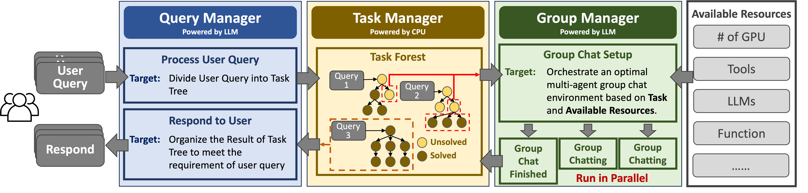
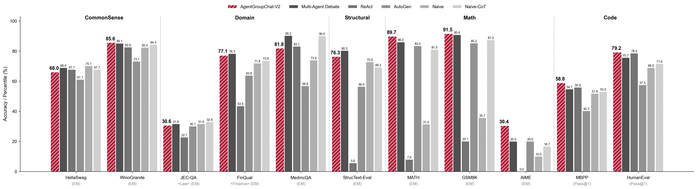
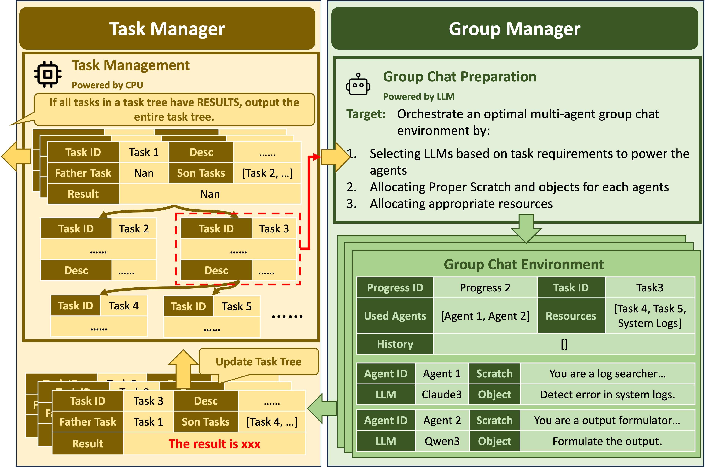

# AgentGroupChat-V2: Divide-and-Conquer Is What LLM-Based Multi-Agent System Need


[](https://arxiv.org/abs/TODO) [](https://www.python.org/) [](./LICENSE)


<div align="center">




</div>

## 📖 Paper Introduction

**AgentGroupChat-V2** is a general-purpose LLM-based multi-agent collaboration framework specifically designed for complex reasoning and task decomposition problems. This framework significantly improves the performance and efficiency of multi-agent systems through innovative **divide-and-conquer strategies**.

### 🎯 Core Innovations

1. **Fully Parallel Architecture** - Adopts a divide-and-conquer architecture with three coordinated management modules, supporting distributed concurrent processing and significantly improving system throughput and resource utilization

2. **Task-level Divide-and-Conquer** - Through dynamic task tree decomposition, complex queries are hierarchically broken down into manageable subtasks with optimized dependency management and parallel execution

3. **Execution-level Divide-and-Conquer** - Through specialized agent role assignment, different LLMs assume distinct roles and focus on specific aspects of problem-solving, enabling adaptive collaboration

### 🚀 Performance Highlights



Our experimental results demonstrate that AgentGroupChat-V2 achieves significant performance improvements across multiple benchmark tasks:

- **Mathematical Reasoning**: Achieves **91.50%** accuracy on GSM8K, exceeding the best baseline by 5.6 percentage points
- **Competition Mathematics**: Reaches **30.4%** accuracy on AIME, nearly doubling other methods' performance
- **Code Generation**: Achieves **79.20%** pass@1 performance on HumanEval
- **Complex Reasoning**: Improvements exceed 11 percentage points on Level 5 MATH problems

Notably, **performance advantages become increasingly pronounced with higher task difficulty**, proving the effectiveness of our divide-and-conquer strategy in handling complex problems.

### 🏗️ System Architecture



AgentGroupChat-V2 employs a three-module architecture:
- **Query Manager**: Responsible for frontend interaction and query decomposition
- **Task Manager**: Handles task flow management and dependency processing  
- **Group Manager**: Manages multi-agent collaborative execution

## 🚀 Code Running Guide

### Environment Setup

```bash
git clone https://github.com/your-username/AgentGroupChat-V2.git
cd AgentGroupChat-V2
pip install -r requirements.txt
```

### Running All Baseline Experiments + AgentGroupChat-V2 Experiments

#### 1. Setup Task Folders

Copy `./tasks/MATH/` to respective task folders: `./tasks/xxx`, where `xxx` is the task name.

For example:
```bash
cp -r ./tasks/MATH/ ./tasks/GSM8K/
cp -r ./tasks/MATH/ ./tasks/HumanEval/
# Jialing needs to copy GSM8K folder to a new GSM8K-level5 folder
cp -r ./tasks/GSM8K/ ./tasks/GSM8K-level5/
```

#### 2. Modify Configuration Files

Modify various `.py` files in `./tasks/xxx`, mainly involving the following content:

```python
# Project path configuration
MODULE_PATH = "/path/to/your/AgentGroupChat-V2"  # Change to your project's absolute path

# API configuration
ENGINE = "xxx"  # Keep unchanged
API_KEY = "your_api_key_here"  # Use your own AIGC website API
MAX_RETRY = 10  # Keep unchanged
SAVE_PATH = "result_naive.json"  # Result save file

# Log and result directories
LOG_DIR = "tasks/your_task_name/logs_qwen_72b"  # Change MATH to your task name
SAVE_DIR = "tasks/your_task_name/results_qwen_72b"  # Change MATH to your task name
ENGINE_NAME = "TA/Qwen/Qwen2.5-72B-Instruct"  # Model to use, note to change to qwen2.5 and llama3.1
```

```python
# Dataset configuration
test_file = "tasks/your_task_name/dataset/test.json"  # Read dataset file
# Note: Jialing's task might not have test_file, replaced by load_dataset(xxx)
# After loading, write code to filter, only need level 5 data
```

```python
# Main execution loop
for i in range(num_problems):
    print(f"========== Solving {i}/{num_problems} Problem ==========")
    problem = test_data[i]
    question, ground_truth = problem["problem"], problem["solution"]  # Read dataset
    
    # Extract ground truth
    pattern = r"\\boxed\{(.*)\}"
    match = regex.search(pattern, ground_truth, flags=regex.DOTALL)
    ground_truth = match.group(1)

    try:
        success, result = solve_problem(question, ground_truth)  # Get prompt + call API
        # ... Process results
```

#### 3. AgentGroupChat Role Configuration

Group chat role configuration files are located in the `./tasks/xxx/characters` directory. You can refer to existing examples for configuration.

#### 4. Run Experiments

```bash
# Run experiments for specific tasks
cd tasks/your_task_name
python run_experiment.py

# Or run all baseline comparisons
python run_all_baselines.py
```

## ⚠️ Important Notice - Current Code Status

<div align="center" style="background-color: #fff3cd; border: 2px solid #ffc107; border-radius: 8px; padding: 20px; margin: 20px 0;">

### 🏖️ Author Vacation Notice 🏖️

**Due to the first author rushing to go on vacation, the current open-source version only includes the core agent group chat functionality code of AgentGroupChat-V2!**

📋 **Currently Available Features:**
- ✅ Multi-agent group chat collaboration core algorithms
- ✅ Complete reproduction code for paper experimental results
- ✅ Comparison experiments with various baseline methods

🚧 **Not Yet Open-Sourced:**
- ❌ Complete three-module system architecture (Query Manager, Task Manager, Group Manager)
- ❌ Adaptive LLM selection engine

**Expected Update Time:** The author will immediately organize and open-source the complete framework code after returning from vacation in the middle of July!

The current code differs from the complete framework described in the paper, mainly because the framework part of the code is still being organized. Please wait patiently for the release of the complete version!

</div>

## 📊 Experimental Results

We evaluated AgentGroupChat-V2's performance on multiple benchmark datasets:

### Mathematical Reasoning Tasks
| Method | GSM8K | MATH L5 | AIME |
|------|-------|---------|------|
| Naive | 35.70% | 19.84% | 10.0% |
| Naive-CoT | 87.33% | 67.32% | 16.7% |
| AutoGen | 85.21% | 66.93% | 20.0% |
| **AgentGroupChat-V2** | **91.50%** | **83.54%** | **30.4%** |

### Code Generation Tasks
| Method | HumanEval (pass@1) | MBPP (pass@1) |
|------|-------------------|---------------|
| Naive | 68.90% | 51.80% |
| ReAct | 78.53% | 55.88% |
| **AgentGroupChat-V2** | **79.20%** | **58.84%** |

## 🤝 Contributing

We welcome community contributions! Please refer to the following ways:

1. 🐛 **Bug Reports**: Use GitHub Issues to report problems
2. 💡 **Feature Suggestions**: Submit Enhancement Issues
3. 🔧 **Code Contributions**: Submit Pull Requests

## 📄 Citation

If you use AgentGroupChat-V2 in your research, please cite our paper:

```bibtex
@article{gu2024agentgroupchatv2,
  title={AgentGroupChat-V2: Divide-and-Conquer Is What LLM-Based Multi-Agent System Need},
  author={Gu, Zhouhong and Zhu, Xiaoxuan and Cai, Yin and others},
  journal={arXiv preprint arXiv:TO BE UPDATED},
  year={2025}
}
```

## 📞 Contact Us

- 📧 Email: zhgu22@m.fudan.edu.cn
- 🏢 Institution: Shanghai Key Laboratory of Data Science, Fudan University

---

<div align="center">

**🌟 If this project helps you, please give us a star! 🌟**

</div>